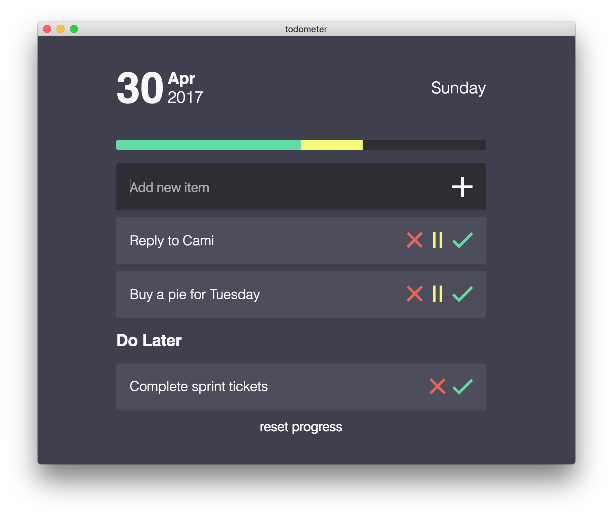

Forked from Cassidy's [todometer](http://cassidoo.github.io/todometer)
=========

A meter-based to-do list originaly built with Electron, React, Redux, and LESS.

The purpose of this repository is to turn the original work from Cassidoo intto a Progressiv Web Application, removing the need of Electron.
